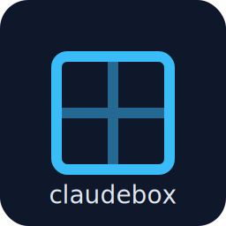
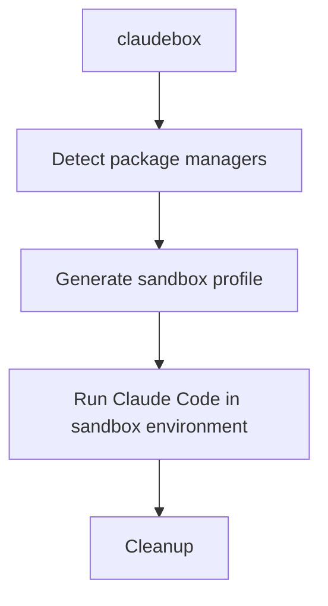

# claudebox

> **⚠️ FORK NOTICE**: This is a fork of the original [claudebox](https://github.com/Greitas-Kodas/claudebox) project by Greitas Kodas.

<div align="center">

</div>

A macOS sandbox - `sandbox-exec` wrapper for Claude Code that provides secure, isolated execution environment with automatic package manager detection and comprehensive configuration options.

## 📑 Table of Contents

- [🔒 What is claudebox?](#-what-is-claudebox)
- [📋 Requirements](#-requirements)
- [⚡ Quick Start](#-quick-start)
- [📋 Commands](#-commands)
- [🛠️ Installation](#️-installation)
- [⚙️ Configuration](#️-configuration)
- [🚀 Features](#-features)
- [📖 Usage Examples](#-usage-examples)
- [🔒 Security Model](#-security-model)
- [🐛 Troubleshooting](#-troubleshooting)
- [🔧 How It Works](#-how-it-works)
- [⚠️ Limitations](#️-limitations)
- [🔐 Security Details](#-security-details)
- [📄 License](#-license)
- [🤝 Contributing](#-contributing)
- [📞 Support](#-support)

## 🔒 What is claudebox?

`claudebox` runs Claude Code inside a macOS sandbox to provide an additional layer of security by:
- Restricting file system access to project directories only
- Blocking access to sensitive directories (`~/Documents`, `~/Desktop`, `~/.ssh`, etc.)
- Allowing only necessary system resources and package manager paths
- Providing configurable process limits

## 📋 Requirements

- **macOS 10.7+** with `sandbox-exec` utility
- **[Claude Code](https://www.anthropic.com/claude-code)** - Anthropic's official Claude CLI
- **Xcode Command Line Tools** (for `sandbox-exec`)

## ⚡ Quick Start

```bash
# Make executable and run Claude Code in current directory
chmod +x claudebox
./claudebox

# Or install globally
sudo cp claudebox /usr/local/bin/
claudebox
```

## 📋 Commands

| Command | Description |
|---------|-------------|
| `claudebox` | Generate profile + run Claude Code (default) |
| `claudebox run [...args]` | Same as default, pass arguments to Claude |
| `claudebox generate` | Build sandbox profile only |
| `claudebox profile` | Print path to generated profile |
| `claudebox validate` | Validate generated sandbox profile |
| `claudebox help` | Show help and examples |

### Claude Code Command Reference

All standard [Claude Code commands](https://docs.anthropic.com/en/docs/claude-code/cli-reference) work within the sandbox:

- `claudebox run --dangerously-skip-permissions` - yolo mode

## 🛠️ Installation

### Option 1: Direct Usage
```bash
git clone <repository-url>
cd claudebox
chmod +x claudebox
./claudebox
```

### Option 2: System Installation
```bash
sudo cp claudebox /usr/local/bin/
claudebox
```

### Option 3: Using install.sh
```bash
./install.sh
```

### Option 4: Nix Flake
```bash
# Run directly from the repository
nix run .

# Run with arguments
nix run . -- --help

# Install to your profile
nix profile install .

# Use in a temporary shell
nix shell .
```

## ⚙️ Configuration

### Environment Variables

| Variable | Description | Default |
|----------|-------------|---------|
| `CLAUDEBOX_VERBOSE` | Enable debug output (`1` to enable) | `0` |
| `CLAUDEBOX_DRY_RUN` | Show what would be executed (`1` to enable) | `0` |
| `CLAUDEBOX_CONFIG` | Path to custom config file | `~/.claudeboxrc` |

### Configuration File

Create `~/.claudeboxrc` to customize behavior:

```bash
# Example ~/.claudeboxrc
ULIMIT_PROCESSES=2048
VERBOSE=1
# Add custom environment variables here
```

## 🚀 Features

### 🔍 Automatic Package Manager Detection
- **Homebrew** (ARM: `/opt/homebrew`, Intel: `/usr/local/Homebrew`)
- **User binaries** (`~/.local`)
- **Node Version Manager** (`~/.nvm`)
- **Fast Node Manager** (`~/.fnm`)
- **nodenv** (`~/.nodenv`)
- **Nix** (`/nix/store`)

### 🛡️ Security Features
- Automatic cleanup of temporary files
- Path validation and sanitization
- Environment validation before execution
- Sandbox profile validation

### ⚡ Performance Optimizations
- **Path caching**: Detection results cached for 1 hour
- **Parallel detection**: Efficient package manager discovery
- **Minimal overhead**: Only validates when necessary

### 🔧 Development Features
- **Verbose logging**: Detailed debug information
- **Dry-run mode**: Preview what would be executed
- **Profile validation**: Verify sandbox configuration
- **Configuration support**: Customizable via files and environment

## 📖 Usage Examples

### Basic Usage
```bash
# Run Claude Code with default settings
claudebox

# Run with specific arguments
claudebox run --help
```

### Debug Mode
```bash
# Enable verbose output
CLAUDEBOX_VERBOSE=1 claudebox

# Show what would be executed without running
CLAUDEBOX_DRY_RUN=1 claudebox
```

### Profile Management
```bash
# Generate profile only
claudebox generate

# Show profile location
claudebox profile

# Validate generated profile
claudebox validate
```

### Advanced Configuration
```bash
# Use custom config file
CLAUDEBOX_CONFIG=/path/to/custom.conf claudebox

# Combine multiple options
CLAUDEBOX_VERBOSE=1 CLAUDEBOX_DRY_RUN=1 claudebox run --version
```

## 🔒 Security Model

### Allowed Access
- ✅ **Project directory**: Full read/write access to current working directory
- ✅ **System binaries**: `/usr`, `/bin`, `/sbin`, `/System`
- ✅ **Package managers**: Detected paths for npm, pip, cargo, etc.
- ✅ **Temp directories**: `/tmp` and system temp folders
- ✅ **Claude config**: `~/.claude` and `~/.claude.json`
- ✅ **IDE configs**: `.vscode`, `.cursor`, `.vim`, `.config` (read-only)
- ✅ **Networking**: Full network access for API calls

### Blocked Access
- ❌ **Personal directories**: `~/Documents`, `~/Desktop`, `~/Downloads`
- ❌ **Media folders**: `~/Pictures`, `~/Movies`, `~/Music`
- ❌ **Sensitive configs**: `~/.ssh`, `~/.aws`, `~/.gnupg`, `~/.kube`
- ❌ **System modifications**: Cannot modify system files

## 🐛 Troubleshooting

### Common Issues

**Claude command not found**
```bash
# Check if Claude is installed
which claude

# If not, install Claude first
# then run claudebox
```

**Permission denied on temp directory**
```bash
# Check temp directory permissions
ls -la $TMPDIR
# or
ls -la /tmp
```

**Sandbox profile validation fails**
```bash
# Check profile with verbose mode
CLAUDEBOX_VERBOSE=1 claudebox validate

# Or inspect the generated profile
claudebox profile
cat $(claudebox profile)
```

### Debug Mode

Enable comprehensive debugging:
```bash
CLAUDEBOX_VERBOSE=1 CLAUDEBOX_DRY_RUN=1 claudebox
```

This will show:
- Environment validation steps
- Package path detection
- Profile generation process
- What would be executed

## 🔧 How It Works

`claudebox` creates a dynamic macOS sandbox profile for each project using Apple's `sandbox-exec` utility. Here's the process:



### 1. Environment Detection
- Scans for package managers (Homebrew, npm, nvm, fnm, nodenv, Nix)
- Detects system architecture (Apple Silicon vs Intel)
- Validates sandbox-exec availability and permissions
- Caches detection results for 1 hour to improve performance

### 2. Profile Generation
- Creates a temporary sandbox profile using template-based replacement
- Injects detected package manager paths into the profile
- Adds project directory with full read/write/execute permissions
- Configures allowed system resources and blocked sensitive directories

### 3. Sandbox Execution
- Validates the generated profile using `sandbox-exec -f profile true`
- Launches Claude Code within the sandbox with restricted permissions
- Automatically cleans up temporary files on exit

## ⚠️ Limitations

### System Requirements
- **macOS only**: Requires Apple's `sandbox-exec` utility (not available on Linux/Windows)
- **macOS 10.7+**: Sandbox technology requires Lion or later
- **Command-line tools**: Requires Xcode Command Line Tools for `sandbox-exec`

### Functionality Limitations
- **Network restrictions**: Some advanced networking features may be limited
- **System modifications**: Cannot install system-wide packages or modify system files
- **Hardware access**: Limited access to hardware resources and peripherals
- **Inter-process communication**: Restricted communication with other processes
- **Cache limitations**: Package manager detection cache may become stale (1-hour TTL)

### Known Issues
- **Slow first run**: Initial package manager detection can take several seconds
- **Path conflicts**: May not detect custom package manager installations
- **Profile validation**: Some edge cases may cause sandbox profile validation to fail

## 🔐 Security Details

### Sandbox Technology
`claudebox` leverages macOS's built-in Application Sandbox technology - `sandbox-exec`, which provides:
- **Kernel-level isolation**: Restrictions enforced at the kernel level
- **Principle of least privilege**: Only grants necessary permissions
- **Resource limitations**: Controls CPU, memory, and file descriptor usage
- **Network filtering**: Allows outbound connections while blocking unnecessary access

### File System Restrictions
```
Allowed Paths:
├── Project directory (full access)
├── /usr, /bin, /sbin, /System (read/execute)
├── Package manager paths (read/execute)  
├── ~/.claude* (read/write for config)
├── IDE configs (read-only)
└── /tmp, /var/tmp (temporary files)

Blocked Paths:
├── ~/Documents, ~/Desktop, ~/Downloads
├── ~/Pictures, ~/Movies, ~/Music
├── ~/.ssh, ~/.aws, ~/.gnupg, ~/.kube
├── /etc (system configuration)
└── Other user directories
```

### Process Limitations
- **Process limit**: Configurable via `ULIMIT_PROCESSES` (default varies by system)
- **Memory constraints**: Inherits system memory limits
- **CPU throttling**: No artificial CPU restrictions applied
- **Signal handling**: Standard signal handling within sandbox boundaries

## 📄 License

MIT License

## 🤝 Contributing

1. Fork the repository
2. Create a feature branch
3. Make your improvements
4. Test thoroughly with `CLAUDEBOX_VERBOSE=1`
5. Submit a pull request

## 📞 Support

For issues or questions:
1. Enable verbose mode: `CLAUDEBOX_VERBOSE=1 claudebox`
2. Check the generated profile: `claudebox validate`
3. Review the security model above
4. Open an issue with debug output

---

**⚠️ Note**: This tool requires macOS with `sandbox-exec`. It will not work on Linux or Windows systems.
